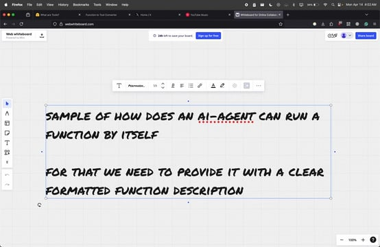

# 🛠️ Function-to-Tool Converter

Turn any well-typed Python function into a structured tool description — perfect for AI agents, function-calling models, and LLM-powered applications.

This tool takes your function and extracts:
- 🔍 Function name
- 🧾 Docstring as description
- 🧩 Parameters and types (with default values)
- 📤 Return type
- 🧠 Outputs a standardized tool summary for use with agents

---

## 🌐 Live Demo

> Paste your Python function and convert it instantly into a structured tool description.

🚀 [Try it live](https://t.co/x0UjMxqonb)
---

## 🧠 Why This Matters

Modern LLM agents (like those powered by OpenAI, LangChain, LlamaIndex, and more) require well-structured metadata about tools they can use. This app helps bridge that gap between raw Python and AI usability.

It’s especially useful for:
- Tool registration with OpenAI Function Calling or LangChain
- Building self-documenting APIs
- Teaching LLMs to understand your code dynamically

---

## 📽️ Demo

Here’s a quick walkthrough of what the tool can do:

[]([https://vimeo.com/1075209461?share=copy](https://13aluminium.github.io/ToolScript/))

---

## ✨ Features

- Paste a function with `@tool` decorator
- Click "Convert" to extract a tool summary
- Optional syntax highlighting
- Built-in example functions
- Copy-ready output for your AI agent

---

## 📦 Example Input

```python
@tool
def get_weather(city: str, units: str = "metric") -> dict:
    """Fetch the current weather for a given city using METAR data.

    Units can be 'metric' or 'imperial'.
    """
    ...
